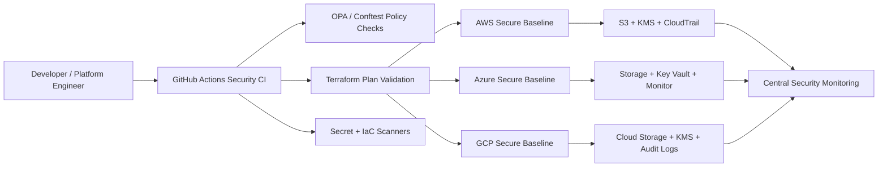

# Multi-Cloud Security Infrastructure Designed Tooling

Security tooling and reference infrastructure for deploying sensitive workloads across AWS, Azure, and GCP. The project focuses on protecting sensitive data, model assets, and production systems with repeatable cloud controls, policy-as-code, and CI security checks.

## Why This Project Exists

Organizations often run production services across multiple cloud providers, but each cloud has different identity, storage, network, and logging primitives. This project provides a consistent security baseline that can be adapted across AWS, Azure, and GCP.

It is designed for teams deploying applications, machine learning services, or platform workloads that need:

- Encrypted storage for sensitive datasets and model artifacts
- Least-privilege IAM patterns across cloud providers
- Private networking for production systems
- Audit logging and centralized monitoring
- Policy-as-code checks before infrastructure reaches production
- CI gates for secrets, Terraform validation, and cloud misconfiguration scanning

## Architecture



More detail is available in [docs/ARCHITECTURE.md](docs/ARCHITECTURE.md).

## Repository Structure

```text
.
├── .github/workflows/security-ci.yml
├── docs/
│   ├── ARCHITECTURE.md
│   ├── SECURITY_CONTROLS.md
│   └── THREAT_MODEL.md
├── policies/opa/
│   ├── storage.rego
│   ├── iam.rego
│   └── production.rego
├── scripts/
│   ├── validate.sh
│   └── scan_model_manifest.py
├── terraform/
│   ├── envs/dev/
│   └── modules/
│       ├── aws-secure-baseline/
│       ├── azure-secure-baseline/
│       └── gcp-secure-baseline/
└── model-assets/
    └── manifest.example.json
```

## Features

- **AWS baseline:** KMS key, private S3 model artifact bucket, CloudTrail, public access blocks, encryption defaults.
- **Azure baseline:** Resource group, Key Vault, private storage account defaults, diagnostic logging placeholders.
- **GCP baseline:** KMS key ring, encrypted storage bucket, uniform bucket-level access, audit logging placeholders.
- **Policy-as-code:** OPA rules that reject public storage, overly broad IAM, and missing production safeguards.
- **CI security pipeline:** Terraform formatting, validation hooks, secret scanning, policy checks, and model manifest validation.
- **Model asset governance:** Example manifest for model artifacts with hash, owner, classification, and approved deployment stage.

## Quick Start

Install the recommended tools:

- Terraform
- OPA
- Conftest
- Checkov
- Gitleaks
- Python 3.10+

Run local validation:

```bash
make validate
```

Validate the model artifact manifest:

```bash
python3 scripts/scan_model_manifest.py model-assets/manifest.example.json
```

Initialize the example Terraform environment:

```bash
cd terraform/envs/dev
terraform init
terraform validate
```

## Example Use Case

A platform team needs to deploy an internal machine learning inference service. The service uses:

- AWS S3, Azure Storage, or GCP Cloud Storage for model artifacts
- Cloud KMS keys for encryption
- Private network access for production services
- Centralized audit logs for security investigations
- CI checks that block public buckets, wildcard admin roles, and unclassified model assets

This project demonstrates the control plane that supports that workflow.

## Security Controls Covered

| Area | AWS | Azure | GCP |
| --- | --- | --- | --- |
| Encryption | KMS | Key Vault | Cloud KMS |
| Storage protection | S3 public access block | Secure storage account settings | Uniform bucket-level access |
| Audit logging | CloudTrail | Azure Monitor diagnostics | Cloud Audit Logs |
| IAM | Least privilege policies | RBAC scope guidance | IAM role constraints |
| Production guardrails | Policy checks | Policy checks | Policy checks |

## GitHub Project Talking Points

You can describe this project on your resume or GitHub profile as:

> Designed a multi-cloud security baseline across AWS, Azure, and GCP using Terraform, OPA policy-as-code, and CI security automation to protect sensitive data, model assets, and production systems.

## Roadmap

- Add environment-specific Terraform variable files for `dev`, `stage`, and `prod`
- Add Infracost budget checks for cloud resource changes
- Add sample SIEM export integrations
- Add Kubernetes workload identity examples for EKS, AKS, and GKE
- Add cloud-native policy mappings for AWS Config, Azure Policy, and GCP Organization Policy

## Disclaimer

This is a reference implementation for learning and portfolio use. Review and adapt all controls before using them in a real production environment.
